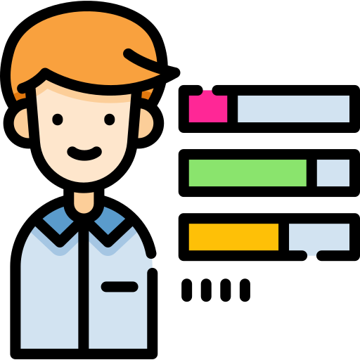

<!---
Consultar a URL para desenvolver os icons das Skils -> https://shields.io
-->

<h1 color="black" align="center"> #Bug shall not pass ! 🧙 </h1>

<h2 align='left'>#About me: </h2>

I'm Diego Arthur ,  Specializing in FullStack Development 👨‍💻.   I'm graduated, self-thaught and passionate about learning.

📍Living: Brazil;   👨‍🎓 College: UFSJ, Ouro Branco- MG.

 

    <h2 align="rigth"></img>#My Skills: </h2>

  

 
 
  

  

 
 

<h2 align='left'>#Github: :octocat:⚙️</h2>
 

    
     
    

